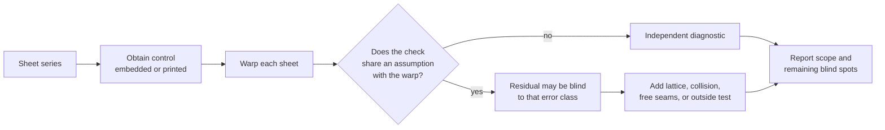
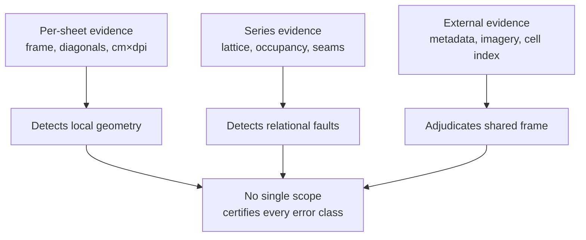
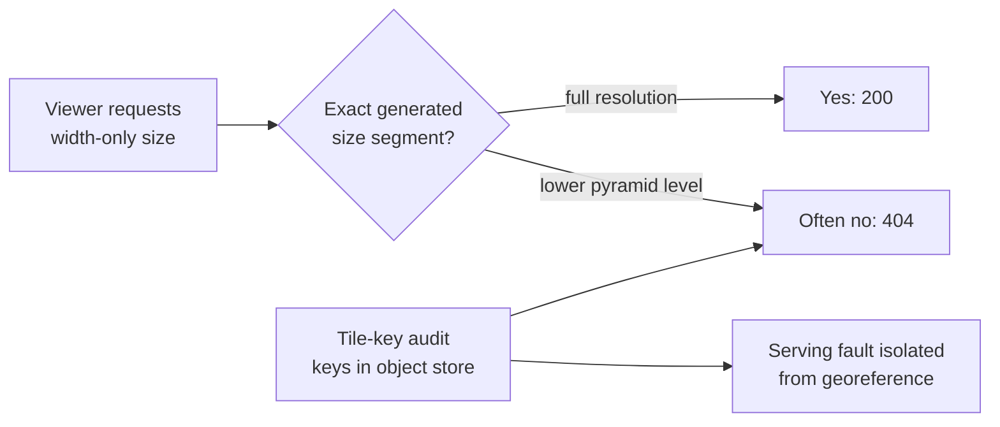
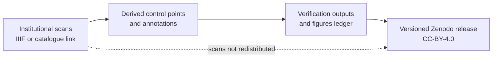

# Blind by construction: verifying a georeferenced map series when the check shares the error

*Two colonial map series of Vietnam, 514 sheets*

## Abstract

Georeferencing a historical map series is usually described as a per-sheet problem: identify control
points, fit a transformation, report a residual. For a series, the control is frequently already
present — embedded in a GeoPDF, printed as graticule corners, or recoverable from a neatline and a
sheet index — and the difficult work moves to verification: establishing that a whole collection has
been placed coherently, and that the resulting evidence can detect its own errors. We report a
documented archive failure that makes the distinction concrete. In the Vietnam Map Archive, a
substantial subset of US Army Map Service L7014 sheets was published under a wrong datum; a
controlled reproduction measures CRS displacements of 395–528 m across 269 sheets, with a median of
455 m. The archive's per-sheet graticule check rejected 11 of 437 sheets and passed all 269
displaced ones, because a sheet's control points and the graticule it prints are translated together
by the same wrong datum. The fault was not hidden by noise; the check was blind to it by
construction. Working from two colonial series and 514 pipeline-georeferenced sheets, we develop a
taxonomy that classifies verification checks by scope and by the information each has already
committed to, and show which
error class each therefore cannot report. Two instruments detect this displacement: a free seam
census, which requires no external reference but sees the fault only because it is partial across the
series, and an outside CRS decision that refuses rather than accept the smaller miss. A lattice occupancy check separately catches a sheet that passes every
per-sheet test while sitting on another sheet's cell, 75 km from the city it is named for. The
claim is deliberately narrow: naming
a check's scope and its committed inputs is a precondition for interpreting the residual it reports.

**Keywords:** historical maps · georeferencing · map series · verification · reference frames ·
reproducibility · spatial data quality

<!--
**Draft started 2026-09-19.** Section numbering is `outline.md`'s. Prose marked **[drafted]** is
carried verbatim from `related-work.md`, where it was written against a full read of the source and
its figures were verified; do not reword those paragraphs without going back to that file.

Every number in this file must exist in `figures.md` with a source. Numbers in `figures.md` §5 are
quotable nowhere.
-->

---

## §1 Introduction

Historical maps are increasingly available as scans, but a scan becomes spatially useful only when
it can be placed, queried and compared with other maps. That operation is often described as a
georeferencing problem: identify control points, fit a transformation and report an error. For a
sheet series, however, the control is frequently already present. It may arrive in a GeoPDF, be
printed as graticule intersections, or be recoverable from a repeated neatline and a known index.
The difficult work shifts from placing an individual sheet to establishing whether an entire
collection has been placed coherently and whether the resulting evidence can detect its own errors.

This distinction matters because a small residual is not a general certificate of correctness. A
check can be accurate for the relation it measures and nevertheless be unable to reveal a datum,
frame or adjacency assumption that it shares with the transformation. In the Vietnam Map Archive,
we published a substantial subset of GeoPDF sheets hundreds of metres from their intended
locations. The pipeline completed, the maps rendered and the per-sheet graticule check passed every
displaced sheet. The fault was not hidden by noise; it was invisible by construction because the
check compared two quantities translated by the same wrong datum. A current reproduction finds CRS
displacements of 395–528 m (median 455 m), with the exact fault population depending on whether it
is counted from the fit or from the CRS displacement.

The size of that silent displacement is a useful warning, but not a benchmark claim. It exceeds the
101 m median error reported by a content-based automatic method and is comparable with some
automatic toponym-based results, yet the tasks are not comparable: those methods locate a sheet from
content, while our pipeline begins with human-placed or source-supplied control. This paper is about
the meaning of verification after control has been obtained, not about claiming that a human-assisted
workflow outperforms automatic georeferencing.

We examine two Vietnamese map series with complementary spatial evidence: US Army Map Service
1:50,000 GeoPDFs, and Service géographique de l'Indochine 1:25,000 sheets whose corners are printed
in grades from the Paris meridian. Across the two processing routes, the recorded run ledger covers
514 pipeline-georeferenced sheets; this is a run total and should not be read as current annotation
availability. The series setting makes relations available that a single sheet cannot supply:
regular lattice spacing,
one-to-one occupancy of cells, shared edges, edition history and a distinction between a proposed
correction and what readers currently receive.

The paper makes three contributions. First, it models a survey as cells, archive sheets and
institutional printings rather than collapsing those states into one map record (§4). Second, it
documents two reproducible georeferencing routes that require no interactive editor: embedded GCPs
and neatlines for L7014, and detected frames plus printed corner labels for Indochine (§§5–6).
Third, it develops a verification taxonomy (§7). The taxonomy distinguishes checks by scope and by
which information they have already committed to. It shows why a lattice residual, a lattice
collision, a free seam residual, an outside CRS decision and a tile-key audit detect different
classes of fault.

Our claim is deliberately narrow. Series self-consistency is not new, and neither are lattice or
adjacency checks. The contribution is to show, with a published failure, that a verification
instrument can be predictably blind to one error class by construction. Naming its scope and its
committed assumptions is therefore a precondition for interpreting the residual it reports.

**Figure 1 — from control to a meaningful verification claim.**

---

## §2 Related work

### 2.1 Georeferencing a sheet series from its own content

<!-- **[drafted]** -->

The nearest prior work is Luft and Schiewe (2021), who georeference sheets of the *Karte des
Deutschen Reiches* 1:100,000 from their content: they segment the blue water symbols, match the
resulting binary mask against OpenStreetMap water rasterised into each candidate sheet's bounding
box, take the sheet with the most RANSAC-consistent patch matches, and finish with an ECC
registration of content against reference. They report 96% correct sheet identification over 56
sheets and a median georeferencing error of 101 m. What concerns us is not the matcher but the
yardstick. Because a line-preserving transform spreads its error linearly, the extreme always falls
at a corner, so they hold the transformed corners against "their expected positions in the series'
sheet layout", and they state the consequence in print: "the alignment of corners also directly
determines the ability to seamlessly join neighbouring transformed map sheets, which is a major
concern for map users." Using the series' own lattice as the standard against which a sheet is
judged is therefore established practice. The check we describe in §7.2 confirms it on a second
series and a different frame; it does not introduce it.

Two properties of that construction bound what the yardstick can see, and both are this paper's
subject. The first is that the sheet-layout bounding boxes are prior knowledge — "constructed in
advance from the map series' metadata" — and are used twice: once to give the output image its
spatial reference, and once as the ground truth the transformed corners are measured against. The
number that results is the residual of the image registration *inside an assumed frame*. Should the
frame itself be wrong — the datum, not the alignment — both sides of the comparison move together
and the residual does not move at all. Luft and Schiewe are explicit that the corner metric is
designed to exclude one class of error: corners are used because "neatlines are the first thing
constructed and have the least projection error, [so] they can be assumed to be drawn at the
'correct' place", which keeps surveying and drawing error out of the measurement. It keeps datum
error out of it too. §7.4 reports a several-hundred-metre datum fault across part of the 437-sheet
L7014 denominator, which a check of exactly this shape passes without a single rejection.

Luft and Schiewe say as much about a third study, and the remark is the clearest statement of this
paper's thesis we have found in the prior literature. Comparing their own result with Burt, White,
Allord, Then and Zhu (2019), who georeference USGS topographic sheets from neatline corners and
graticule intersections, they note that those authors reach "almost perfect accuracy of 1–4 px RMSE"
and immediately qualify it: the figure "reflects the detection accuracy of graticule intersections on
the map image and is hardly influenced by the georeferencing process itself." That is precisely the
distinction Table 1 formalises — a residual reports the relation it measures, not the one its reader
wants — observed in passing rather than developed. We take it as a precedent for the argument, not as
a gap.

The second is that the seam is asserted rather than measured. Corner displacement is computed per
sheet against the layout and averaged over four corners into a single value; no two neighbours are
ever compared to each other. A per-sheet residual cannot separate a sheet that sits slightly off its
cell from two sheets that claim the same cell — the failure that caught `Ha Noi`, 75 km from the city
it is named for while satisfying every per-sheet check (§7.2). Inter-sheet agreement as a *constraint* is well
established: Janata and Cajthaml (2020) adjust a 250-sheet series under explicit adjacency
conditions. We treat unforced inter-sheet agreement as a diagnostic in this archive, without
claiming priority for that use.

Gede and Varga (2021) are the closest prior route to the Indochine method in §6. They detect the
map-content corners, recognise a sheet identifier by OCR, derive the quadrangle from that identifier
against a known layout, and use the corners as GCPs. Their geometric analysis automatically filters
false corner detections. Our sheets differ at the decisive step: they print their own corners in
grades from Paris and have no identifier-to-extent table, so the coordinate reading replaces the
lookup. Uhl et al. (2018), in turn, use GCP displacement vectors as a per-sheet anomaly measure
across map archives. Both methods reinforce the point of this paper: a useful per-sheet diagnostic
is not thereby a diagnostic of a fault that belongs to the series frame.

### 2.2 Inter-sheet agreement, spent as a constraint

<!-- **[drafted]** -->

Inter-sheet agreement has been used before, as a constraint. Janata and Cajthaml (2020) adjust 250
sheets of the First Military Survey of Bohemia in a single least-squares solution — 6,849 control
points, more than 27 per sheet — in which the coincidence of shared sheet edges enters as a set of
condition equations, robustified by iteratively reweighted least squares under Huber's M-estimate.
The series was mapped *à la vue* and has no geodetic basis, so no projection can be inverted and the
sheet edges are the only geometry available a priori; using them is the right move, and their best
solution reaches 280 m RMSE on a corpus whose own drafting is far coarser than that. The consequence
for verification is structural rather than accidental. Once edge identity is imposed as a condition,
"the adjacent edges fit exactly together" by construction, and the seam residual is identically zero
however the mosaic as a whole is placed. Information spent as a constraint cannot be spent again as
a diagnostic. The seam census we report in §7.3 is legible only because no adjacency condition was
applied.

This is the same shape as the limit described in §2.1, arrived at by a different route, and neither
is a defect in the work that exhibits it: Luft and Schiewe cannot see a frame error because the
frame stands on both sides of their metric, and Janata and Cajthaml cannot see a seam error because
the seam is an input to their solution. What the two have in common is that the quantity a reader
would most naturally reach for as evidence of correctness is, in each case, the quantity the method
has already committed to. We take this as the general statement of the problem rather than as a gap
in the literature.

Both papers also report the limits of their own instruments, which is the register this one adopts.
Janata and Cajthaml assembled about fifty control points, held out from the adjustment, to decide
whether their mosaic or the Mapire.eu layer was better placed, and reported that "it is not possible
to unambiguously decide which dataset is better adjusted" — the medians agree at about 250 m and
fifty points do not cover Bohemia. They separately report a null on weighting control points by
object category. We report comparable nulls in §8.

### 2.3 Per-sheet consistency checks

Meijers and Schoonman (2025) reach the neatline the way we do and applies a substantial per-sheet check set.
MapEdge detects the frame of 557 sheets across three 1:50,000 series by taking 1D
black-pixel profiles along each axis of a low-resolution overview, ranking candidate peak pairs by a
fuzzy metric over separation and expected position, then repeating the profile on full-resolution
edge strips cut into patches, fitting a line per side by RANSAC and intersecting the four lines. The
corners serve as both the control points and the mask, at about 15 s per sheet. Both that method and
ours read the same quantity off the same strips; the difference is peak selection, where MapEdge
ranks candidates against a user-declared fuzzy width prior and we take an unthresholded `argmax`
because on these sheets the thick neatline is the darkest thing on the strip by a factor of three.
Ours needs no prior and cannot be tuned; theirs adapts to layouts ours would fail on.

What matters here is the battery of five checks applied afterwards: sufficient rim samples and
RANSAC inliers; an internal test that
opposite sides and diagonals agree; an external test of documented sheet size in centimetres times
scan dpi against the measured pixels; the distribution of inlier perpendicular distances, which
detects paper bulging or caving; and a visual contact sheet of every detected corner. The battery works — on three sheets it revealed that sheet-size exceptions had been digitised wrongly
in the authors' own sheet index, which was corrected as a result. All five are nonetheless per-sheet, and
§7.2 reports a sheet that passes all five while sitting 75 km from the city it is named for, because
a sheet occupying another sheet's cell is not a per-sheet property.

Meijers and Schoonman also state in print the failure our own detector hits: "linear features, such as graticule
lines, can occupy the same number of black pixels as the neat line." §6 reports a worked case of
exactly that — a walk stopping on the graticule band, 40 px and 170 m short, every edge rejected —
and what we do about it. We take this up as the open problem its author names, not as a deficiency
we found.

### 2.4 Verification beyond geometry

External evidence is also used in automatic georeferencing, but it answers a different question from
the internal checks above. Milleville, Verstockt and Van de Weghe (2022) geocode recognised toponyms,
filter candidate locations and score predictions against independent official metadata polygons or
GeoTIFF corners. Their reported mean errors are 316 m and 287 m on two adjacent-sheet corpora. Their
own caution is directly relevant here: centre error can agree while the predicted extent remains
wrong. An apparently simple metric is only evidence for the property it actually measures.

Text and image understanding methods extend the available evidence but do not remove that constraint.
Wijegunarathna, Stock and Jones (2025) report approximately 1.03 km mean error for locality
georeferencing from textual descriptions; Namgung and Chiang (2022) use spatial relationships among
words to improve post-OCR rather than treating a map as a line of prose. mapKurator (Kim et al., 2023) and the
ICDAR 2024 MapText competition (Li et al., 2024) demonstrate the scale at which map text can now be
detected, recognised and linked. These are important routes toward independent reference, but they are not substitutes for
stating what a geometric check can and cannot observe. We therefore use outside information only
where it separates competing datum hypotheses (§7.5), rather than presenting it as a universal
ground truth.

Recent multi-sheet work makes the same distinction from another direction. Kuna, Panecki and
Zawadzki (2024) identify a difference between the mathematical framework and topographic content as
a source of error accumulation during mosaicking; they caution that, despite good geometric
parameters, a grid without the correct datum relationship is “not a reliable element of the
mathematical framework”. They then rectify all 60 sheets of their corpus against an independently
generated grid. Xu, Li and Lv (2026) likewise construct an external reference grid
to supply conjugate control points for batch georeferencing. These studies do not make our
blindness claim, but they show why the independence of a frame cannot be assumed from a low internal
residual: it is a design choice that has to be stated. In a related operational setting, Ingensand,
Lecorney and Blanc (2022) describe validation indicators based on GCP count, computed error and GCP
coverage. Those indicators are useful gates; Table 1 specifies the error classes they leave
outside their scope.

Tyagi and Dubey (2026) read printed map text with OCR and a multimodal model to derive a sheet's
extent, which is the closest published neighbour to the printed-corner method in §6. We have not
obtained the full text and therefore attribute no result to it.
Legend detection is likewise outside this paper's scope: it concerns what a sheet depicts, not
whether the sheet's spatial frame is independently verified.

**Figure 2 — verification evidence has distinct scopes.**

---

## §3 Corpus

The corpus comprises two colonial and Cold-War Vietnamese sheet series, treated as series rather
than as a collection of otherwise unrelated map images. L7014 is the US Army Map Service 1:50,000
coverage of Vietnam, held as GeoPDFs by the Perry-Castañeda Library at the University of Texas at
Austin. The second is the Service géographique de l'Indochine 1:25,000 coverage of Tonkin and Thanh
Hóa, held by Cartomundi at Aix-Marseille Université/CNRS. Together the recorded processing ledger
covers 514 sheets: 452 L7014 sheets published as one PMTiles mosaic and 62 Indochine sheets. Current
publication and annotation status is tracked separately from that run total. The L7014 material dates
from the 1960s–70s; the Indochine material from 1903–1927.

Several L7014 denominators appear below and they are not interchangeable; Figure 6 shows all of them
on one map. The series index names **627** cells. **510** of those are held as GeoPDFs. Of the 510,
**437** carry usable control and warp successfully — 62 have no GCPs and 11 land off their cell — and
it is this 437 that the datum measurements in §7 are taken over. A further **24** sheets are
georeferenced by hand rather than from embedded control, and sit outside that fault. The **452** in
the published mosaic is a hand-maintained constant rather than a count read back from the serving
manifest, and a corrected rebuild produces 436; we report it as the archive's own claim about itself
and flag it in §7.6 rather than silently substituting a number the live layer cannot confirm. On the
Indochine side, **79** cells are indexed and **75** held; **62** were georeferenced by the pipeline,
**58** were read independently for the lattice check in §7.2, and the IIIF survey in §7.7 covers the
**83** image sources those sheets resolve to, some cells holding more than one edition.

The two series are deliberately unlike in how they supply spatial evidence. L7014's source PDFs
carry GCPs and a CRS declaration but require a test of that declaration. The Indochine sheets carry
no embedded georeference but print corner coordinates and a regular quadrangle scheme. This contrast
is useful for the paper's question: the checks in §7 do not depend on a single ingestion route, but
on relations a sheet series makes available after its coordinates have been read.

The corpus is not a representative sample of all historical maps of Vietnam, nor is it a ground
truth dataset for absolute positional accuracy. Its holdings, digitisation quality and availability
follow the decisions of the contributing institutions. The findings below should therefore be read as
a failure taxonomy demonstrated on two well-structured series, not as a benchmark ranking against
methods that recover a sheet's location from no prior spatial information.

**Figure 3 — indexed cells, holdings and pipeline-georeferenced sheets in each series.**

## §4 C1 · Modelling the survey

The archive models three related but non-interchangeable things: a survey cell, a sheet the archive
can serve, and a physical printing held by an institution. A cell is the quadrangle named by a series
key and sheet number. A served sheet records the archive's present route to that cell, whether as a
`maps` row, a raster in a pre-tiled mosaic, or an unheld gap. A printing records an edition at a
particular institution, including its title, date, part and source identifier. The distinction is not
abstract: the same cell can be reprinted years apart, renamed, or issued as eastern and western
halves before a later assembly.

This model makes the denominator visible. The ordinary `maps` table contains only successful archive
objects, so it cannot distinguish a survey of nine sheets from a survey of 627 cells of which nine
have been acquired. A series index supplies that denominator. It also prevents duplicate editions
from being counted as extra geographic cells, while retaining their bibliographic differences at the
printing level.

Status is derived rather than stored: whether the archive holds or serves a cell follows from the
current route and source records. Likewise, the printing index has no foreign key to the archive's
own sheet table. An institutional printing for an as-yet unindexed cell is precisely the discovery
the index exists to record; rejecting it because the archive does not already possess the cell would
turn new catalogue knowledge into an import error. The same separation lets the dry run in §7.6
validate a corrected representation before the serving mosaic is changed, and it supplies the
adjacency and occupancy relations required by the seam and lattice checks.

## §5 C2 method A — L7014

L7014 is a case where georeferencing control already arrives with the object. Each US Army Map
Service 1:50,000 GeoPDF carries ground control points and a printed neatline. We convert the control
points into a VRT, clip the image to its neatline, warp the clipped image to Web Mercator, and build
the resulting rasters into one PMTiles archive. A compact companion index holds an outline, sheet
number, name, edition and date for each constituent sheet. The choice of a pre-tiled archive is a
serving decision: it turns a large series into one static object-store resource rather than a tile
server or hundreds of per-view requests.

The procedure is intentionally conservative about what the source file establishes. Embedded GCPs
locate the raster under the source's CRS claim; the neatline determines what part of the scan is map
rather than collar, legend or paper. Neither fact verifies the CRS claim, and neither independently
tests a join after the warp. The rest of this paper follows from taking those limits seriously. In
particular, the datum fault in §7 was not a failure to find control points or to execute a
warp. It was a failure to test an assumption carried by both.

Figure 4 shows what a single sheet makes available, and why those two facts are not independent
evidence about each other. The sheet prints its own corner coordinates and, in its collar, the datum
those coordinates are expressed in. A check that reads control points under the declared datum and
compares them with the printed graticule is therefore comparing two quantities that a datum error
moves together — the mechanism §7.4 measures.

**Figure 4 — a sheet prints its graticule and declares its datum; a check that uses both cannot test
either.** A Lưới 6441-4, AMS Series L7014 (US Army Map Service; scan by the Perry-Castañeda Library,
University of Texas at Austin). US Government work, public domain.

## §6 C2 method B — Indochine

The Indochine 1:25,000 series has no embedded georeference, but it prints the required information.
On each sheet, four corner labels give longitude and latitude in grades from the Paris meridian. We
detect the pixel positions of the inner neatline, OCR the four short labels just inside its corners,
convert grades to degrees by multiplying by 0.9, add 2.3372 degrees for the Paris-to-Greenwich
offset, and write the resulting four control points as a Georeference Annotation. On Như Trác, for
example, the printed box converts to 18.75 by 12.48 km with aspect ratio 1.50, while the detected
neatline measures 4,496 by 3,014 px with aspect ratio 1.49. These are independent checks on the
reading, not a claim that four corners exhaust the sheet's geometric uncertainty.

The detector differs from a simple inward edge walk because the printed layout has several plausible
linear features. From the paper edge inward sit a thin line, a thick neatline, another thin line,
blank paper, and a graticule band. An inward walk stops at the graticule band: on Như Trác, 40 px or
about 170 m short, with 14–41 px residuals and all four edges rejected. We instead fit the thick
neatline. It is the darkest feature in the edge strips by a factor of three, so its per-patch choice
is an unthresholded `argmax`; the fitted line then supplies both the side position and the scan's
rotation. The rim is only sought after de-tilting and averaging a narrow strip along that line.

Two implementation constraints follow from the scans rather than from an aesthetic preference. The
rough pass averages a narrow band, not half a sheet: scans can be up to 0.8 degrees off square, and
a half-sheet average smears a ten-pixel line across 30 pixels, moving Như Trác's top neatline by
35 px. And the rotation is solved once from all four sides. Independently fitted side slopes differ
by only about a thousandth, but over several thousand pixels that is enough for opposite sides of a
quadrilateral to differ by 14 px where the projection predicts four. One global angle preserves a
single sheet geometry; each side subsequently retains only its own offset.

The method does not conceal its remaining ambiguity. The rim is a pair of thin lines seven pixels
apart. We select the inner line because it gives 0.29% disagreement between the two ground-scale
estimates, rather than 0.49% for the outer line, and because it bounds the drawn map. That preference
is below the roughly 0.3% floor set by paper shrinkage and detection noise. Reading the printed
graticule ticks would resolve it and would supply interior control points; it is deferred rather than
represented as an achieved precision.

---

## §7 C3 · Verification

### 7.1 What a series already knows about itself

The lattice, the seams, the rim constant and the sheet numbering are all prior knowledge a series
carries about itself, and each supports a check. The checks do not overlap the way their surface
similarity suggests. **Table 1** states this paper's thesis: rows are checks, columns are
error classes.

**Table 1 — which check sees which error class.**
Legend: **✓** catches it · **·** silent · **—** not applicable · **∅** cannot fail by construction ·
**†** only where the fault is *partial* across the series, so that a displaced sheet borders an
undisplaced one; a displacement common to every sheet leaves every seam closed (§7.3).

| check | scope | misregistration inside the frame | the frame/datum itself wrong | two sheets on one cell | sheet-index entry wrong | serving/tile fault |
|---|---|:--:|:--:|:--:|:--:|:--:|
| Corner residual vs sheet layout — *Luft & Schiewe 2021* | per-sheet | ✓ | · | · | · | — |
| Internal consistency: sides, diagonals, cm×dpi, paper bulge — *Meijers & Schoonman 2025* | per-sheet | ✓ | · | · | ✓ | — |
| `graticule_error` — sheet's GCPs vs the graticule it prints | per-sheet | ✓ | **∅** | · | · | — |
| Adjacency as a least-squares constraint — *Janata & Cajthaml 2020* | inter-sheet | ✓ | · | · | · | — |
| …the same adjacency read back as a residual | inter-sheet | **∅** | **∅** | **∅** | **∅** | — |
| **Seam census** (adjacency left free) | inter-sheet | ✓ | **✓ †** | ✓ | · | — |
| **Lattice residual** | series | ✓ | · | · | ✓ | — |
| **Lattice collision** | series | · | · | **✓** | ✓ | — |
| **`pick_crs`** — neatline warped under both readings, judged against the cell | external | · | **✓** | · | · | — |
| **Tile-key audit** | serving | — | — | — | — | **✓** |

Three cells carry the argument, and each is sourced to a different paper's own design.

First, `graticule_error` on "frame/datum wrong" is `∅`, not `·`. It does not merely miss the fault;
it cannot report it under those shared-input conditions. The sheet's control points are read into the
sheet's own datum and compared against the graticule that same sheet prints, so a datum error moves
both sides together — the check passed all 269 displaced sheets, and returns 2.167e-12 on a sheet
it places correctly (§7.4). Luft and
Schiewe's corner metric has
the same shape, and says so without meaning to when it justifies corners on the grounds that
neatlines "can be assumed to be drawn at the 'correct' place".

Second, adjacency-as-constraint turns an entire row to `∅`. Once edge identity is a condition
equation, the edges fit by construction; the information was spent. Our seam row is the same
measurement left unspent, and it is the row that caught the fault (§7.3).

Third, every per-sheet row is `·` on "two sheets on one cell". MapEdge's five checks cover several
per-sheet properties, and `Ha Noi` survives all five while sitting 75 km from the
city it names (§7.2). A per-sheet check cannot see a property that is not per-sheet.

The claim this table licenses:

> Verification instruments for georeferenced series are routinely blind to one error class by
> construction, and which class is predictable from the instrument's scope and from what the
> instrument has already committed to. Naming the scope is therefore a precondition for reporting a
> residual.

It does not claim that the lattice is novel, that adjacency is novel, or that any of these papers
made a mistake. Every `∅` is the ordinary consequence of a sound design — including ours, which is
the worst row in the table: `graticule_error` was shipped, trusted, and silent for the affected
subset of the 437-sheet denominator.

### 7.2 The lattice: residual *and* collision

We read 58 sheets independently, before asking whether their readings formed a series. Their west
edges contain nine distinct values with a smallest step of 0.200 grades; their north edges contain
fifteen with a 0.125-grade step. Both sets lie on those lattices with residual 0.000 at the precision
of the printed corner readings. A separate pixel-space check reaches the same conclusion about the
scan geometry: the rim-to-neatline offset has a median of 84.2 px, and all 58 sheets lie within 15%
of it. Sheet numbers introduce no row-order exceptions. These are relative checks. They establish
that the readings make one internally coherent grid; they do not establish where that grid lies in a
modern datum.

The lattice has a second operation that a residual cannot perform: it makes duplicate occupancy
visible. `Ha Noi` (sheet 20, 1903) is the useful counterexample. Its corners agree with one another,
its ground scale agrees with its pixels to 0.78%, its rim is at the series offset, and its content is
unambiguously Hanoi. Yet its printed latitude places it 75 km south of the city, on the cell occupied
by `Ninh Bình`; the longitude is right and the latitude is a clean 0.75 grades out. The MapEdge
per-sheet battery described in §2.3 would have no reason to reject it. Nor would a small lattice
residual: a sheet can sit perfectly on a cell that belongs to another sheet. The collision is the
evidence. A collision is a review flag: it may represent intentional alternative editions, a printed
index anomaly, or an archive/transcription error. Both editions are retained here pending a human
decision about which explanation applies.

Residual and collision therefore answer different questions. The former asks whether independently
read coordinates form the expected spacing; the latter asks whether the sheet index is one-to-one.
Conflating them would make the `Ha Noi` case disappear into an otherwise excellent grid.

### 7.3 The seam census

The lattice compares sheets to the series frame. A seam compares each sheet to its neighbour while
leaving that relation out of the warp. In the mosaic-only reproduction, 717 PDF/PDF seams have a
median displacement of 9.2 m and 97 exceed 300 m. Splicing in the separate hand-sheet rows produces
a second, hand-extended cohort of 778 seams: 36 additional JPG/PDF seams and 25 JPG/JPG seams. The
hand-extended cohort has the same 9.2 m median and 111 seams over 300 m. The hand-extended cohort
includes the mosaic-only cohort; the two denominators are reported separately rather than treated as
independent samples.

The distribution is not a diffuse consequence of paper distortion. The 36 hand-to-mosaic seams span
1.8–446.2 m; none falls in the earlier 447–504 m band. A seam reports only the component normal to
the shared edge: the hand comparisons have medians of 438.0 m east/west and 133.7 m north/south,
recombining to 457.9 m, close to the 454.9 m median CRS displacement.

The free comparisons need to be distinguished from those hand-to-mosaic checks. A JPG/PDF seam uses
the PDF sheet's departure from its lattice cell as one side of the comparison, because the hand
workflow writes that cell as the ground half of its control point. It is therefore a useful archive
diagnostic, but it is not the independent free seam described at the start of this section. The free
comparisons are the PDF/PDF and JPG/JPG seams; the 25 JPG/JPG seams span 0.0–0.6 m.

Because the two warps differ in exactly one flag, the free seams can be read as a controlled A/B, and
it is the free cohort that carries the result. The faulty pass leaves 189 of its 717 PDF/PDF seams
more than 100 m open — 92 between 100 and 300 m and 97 above 300 m. The corrected pass, over a
near-identical 715, leaves **none**: the worst free seam falls inside 100 m and the median improves
from 9.2 m to 6.8 m (Figure 5). The two runs are separate builds rather than subsets of one
population, which is why the PDF/PDF counts differ by two.

This is also the limit of the instrument. What the seam census detects is *differential*
disagreement across a shared edge, and it fired here only because the fault was partial: a displaced
sheet was somewhere adjacent to an undisplaced one. Had every sheet in the series moved by the same
vector, every seam would have closed exactly as before and this census would have reported nothing.
The instrument found the fault because the fault had a boundary — the boundary Figure 6 maps.

The seam anomaly was the first inexpensive indication, in this archive, that it had split into two
spatial populations. The measurement needs neither a reference map nor a new set of control points:
it needs only two sheets that claim to share an edge. Its value is diagnostic: it catches a
disagreement that a per-sheet metric cannot see, provided adjacency has not already been imposed as a
condition of the solution. A common displacement preserves a seam, just as it preserves any other
relative measurement.

**Figure 5 — free seam displacement before and after the datum correction. Every seam over 100 m —
189 of them — disappears.**

### 7.4 The blind self-check

The seam anomaly led to a datum fault in the L7014 GeoPDF pipeline. The 437-sheet denominator contains
a fault population that depends on the measurement: 276 sheets under the fit criterion and 269 under
the CRS-displacement criterion. Their displacements span 395–528 m, with a median of 455 m. Some
files carried an NGA LGIDict datum
label that GDAL could not map and were warped after a warning with a WGS 84 fallback. More subtly,
even a sheet explicitly labelled `Indian_1960` could fail: the `EPSG:4131` to `EPSG:4326` operation
returns the input unchanged outside its area of use. The behaviour is non-uniform: a probe at
106.00 E, 16.00 N moves about 470 m, while one at 109.25 E, 13.25 N moves 0. The production archive
therefore contains a discontinuity rather than one uniform translation.

Our existing `graticule_error` check did not report it. In the faulty pass it rejected 11 of the 437
warped sheets and passed all 269 that the CRS probe places 395–528 m from where they belong. This is
not a sensitivity limit: the rejections it did issue fire between 0.004 and 0.076 degrees off the
printed graticule, so the instrument has a working dynamic range and still returned nothing on a
455 m translation. On A Lưới — which `pick_crs` resolves to its declared CRS, and whose CRS
displacement is 0.0 m — it returns `2.167e-12`. The check reads control points into the sheet's
declared datum and compares them with the graticule printed by that same sheet, so a datum mistake
translates both operands together. It remains useful for errors it can see, such as a wrong zone or
a sheet off its grid, but it cannot test the datum shared by its two inputs. This is an empirical
instance of the `∅` rather than `·` distinction in Table 1: the fault cannot produce a non-zero
result under this instrument.

The same check failed a second time, in the opposite direction, and the second failure is worth
recording because it is the first one's mirror. `graticule_error` read its transformed coordinate
pair positionally, and the two spatial-reference objects it compares disagree about axis order while
reporting the same axis strategy. Every sheet the datum correction moved was therefore transposed,
producing an apparent error of tens of degrees, and **370 of 437 sheets were rejected — the datum fix
thrown out by the check it was meant to supersede**. Pinning both operands to traditional order took
the rejections from 370 to 1. A check that cannot see a real fault and a check that rejects a real
correction are the same defect seen from two sides: in neither case was the quantity being compared
the quantity the reader assumed.

The fault is also not uniform across the series, and its shape is geographic rather than random.
Figure 6 places all 627 indexed cells and colours each by the route its sheet took. The 269
displaced sheets fall in two groups, north and south, separated by a band between roughly 14°N and
17°N in which no sheet took the faulty route at all. That band is why a single probe can mislead:
the archive holds two spatial populations, not one translated whole.

**Figure 6 — the fault in geographic space, and the denominators it reconciles.**

### 7.5 The outside opinion

We replaced that circular test with `pick_crs`. For each affected sheet it warps the neatline twice:
once under the sheet declaration and once under Indian 1960 with an explicit Everest 1830 (1937
Adjustment) Helmert transformation. Each candidate is then compared with the independently derived
15-minute lattice cell. The candidates differ by roughly 470 m; the cell localises the correct one
to about 15 m. This is not an optimisation looking for the smallest residual among comparable
answers. It is a comparison of two specific datum hypotheses against a third source of information.

The decision rule matters as much as the preferred candidate. If neither warp lands sufficiently near
the cell, `pick_crs` refuses the sheet rather than accepting the smaller miss. Refusal preserves a
disagreement for review; choosing the least bad candidate would silently convert an unmodelled error
into a published location. The lattice is not independent of every possible error, but it is
independent of the GeoPDF datum declaration being tested, which is the independence this decision
requires.

### 7.6 The fix, validated without being applied

Applying the explicit Helmert transformation in a dry run changes which sheets reach their cell at
all. The corrected pass warps 436 sheets to the faulty pass's 437, and 434 of them land on their
cell against 161 before. Sheets more than 150 m off their cell fall from 276 of 437 to 2 of 436. The
median miss among on-cell sheets barely moves — 11 m before, 10 m after — because the correction
does not improve sheets that were already placed; it moves displaced sheets onto their cells. For
the same reason the worst on-cell miss rises, from 50 m to 95 m, as 273 sheets join that population.
The two the correction leaves off cell are `6630-4` Xa Phan Thiet (mean 662 m) and `6349-4` Cua Tra
Ly (mean 396 m); in both the worst corner far exceeds the mean, which reads as a distorted or
mis-clipped outline rather than a datum problem. The same method leaves the 24 hand-georeferenced
sheets outside the fault: their control-point residuals remain 2.3–19.0 m RMS. These figures
validate the proposed interpretation and correction; they do not describe a rebuilt public mosaic.

That distinction is deliberate, and the live state is worse than "uncorrected". At the time of
writing the `l7014-20260913` archive has not been re-warped or re-uploaded, and its sheet manifest
returns 404: the build shipped pixels without the accompanying `.geojson`, so `fit` cannot be run
against the serving layer at all and the 452 constant quoted in §3 cannot be checked against it. What
readers currently receive is therefore not merely displaced but unmeasurable from outside — itself an
instance of §7.7's point that a serving layer needs its own instrument. The published fault is
therefore part of the result, not a historical problem retrospectively erased from the evidence. A
rebuild is an operational next step; reporting the dry run separately prevents it from being mistaken
for a measurement of the current serving layer.

**Figure 7 — the dry run moves sheets onto their cells: 161 → 434 on cell, 276 → 2 off by more than
150 m.**

### 7.7 One layer down: a serving check

The same scope rule applies after georeferencing, when a correct source image is requested from an
image service. An audit of the Indochine IIIF endpoint found that its generated tiles use explicit
`w,h` size segments, whereas canonical IIIF clients, including the rendering stack used here, request
a width-only segment. The two forms agree at full resolution, so a superficial whole-image test
passes. One level below the overview they disagree for 58.6% of tiles across the 83-sheet survey.
The resulting 404 reads as “Source not found”, which describes neither the source nor the real
fault: the endpoint cannot compute an arbitrary requested size at that scale.

This is not a georeferencing error and should not inflate the positional claims above. It belongs in
the taxonomy because it demonstrates the same operational lesson at the serving layer. A successful
full-resolution request does not test the tile keys a viewer will actually request. The appropriate
instrument is a tile-key audit against keys present in the object store; it has no opinion about
datum, lattice or seam geometry, and those checks have no opinion about it.

**Figure 8 — a request can be valid IIIF syntax and still miss the server's tile grid.**

---

## §8 Negative results

Several plausible checks did not yield evidence strong enough to carry the argument. For the
Indochine datum, we warped one 1903 sheet from its detected corners and compared the Red River with
modern imagery. Across 794 rows the modern channel lay at a median of 58 m east of the historical
one, with a ±180 m spread. That is compatible with a small east–west displacement, but the channel
runs north–south and therefore provides no north–south constraint; a two-dimensional correlation
peaked at the edge of its search window. River migration, not the georeference, dominates the
remaining variation. The southeast confluence agrees to about 100 m, which is reassurance rather
than a measurement.

Toponym lookup was less useful still. Of twenty village names transcribed from the sheet, only four
returned a single OpenStreetMap result, and even an apparently good administrative match can describe
a modern settlement rather than its historical core. Correlating historical ink density with modern
red-roof pixels produced a smooth, peakless surface driven by the rectangular overlap of the masks.
Neither result is retained as a weak positive. Both delimit what an external check would need before
it could adjudicate the Indochine datum.

The image-derived method also has known exceptions. Gia Bình, Phúc Nhạc, Quất Lâm and Thái Bình need
hand-placed corners because thin-frame editions or inconsistent rim offsets defeat the thick-line
assumption. The unresolved pair of rim lines is worth roughly 30 m, and only the printed graticule
ticks can settle it. These limitations are not failures of the lattice or seam instruments; they are
limits on the quality of the per-sheet readings those instruments are asked to compare.

## §9 Discussion

The contribution is not a new universal accuracy statistic. It is a way to decide what a statistic
can mean before reporting it. Every verification check has a scope, and some checks reuse a datum,
frame or adjacency relation that the georeferencing procedure already assumed. Such a check may be
entirely appropriate for detecting local misregistration while being incapable of detecting a
shared displacement. The useful question is therefore not whether a residual is small in isolation,
but which error classes could have made it small.

For a regular series, this yields a practical ordering of checks. Begin with low-cost relations the
series itself supplies: lattice spacing, one-to-one cell occupancy and free seams. Use an external
reference only when the suspected failure is shared by the entire series frame, as in `pick_crs`.
Do not turn a diagnostic relation into a hard constraint if it will later be the only available test
of that relation. And preserve refusal as an outcome: an anomalous sheet is information for review,
not an invitation to publish the least implausible transformation.

The reasoning may apply beyond these two series where its structural conditions hold. A seam census
requires enough adjacent sheets, a lattice requires a known regular scheme, and neither substitutes
for an independent absolute reference. Conversely, an individual sheet can receive only per-sheet
checks, which is precisely why its residual must not be made to imply more. The archive model in §4
is part of the method here: series membership, editions, gaps and serving routes are not merely catalogue
metadata when they determine which verification relations can be computed.

## §10 Conclusion

A georeferenced map series arrives with more evidence about itself than a single sheet can offer, and
the practical question is not how much of it to gather but what each piece is still free to say. We
published 269 sheets of a 437-sheet series between 395 and 528 m from where they belong. The check
that should have caught it returned effectively zero, not because the fault was small or the code was
wrong, but because the quantity it compared had the error on both sides. Two instruments did see it:
a free seam census, which cost nothing beyond two sheets claiming a shared edge and worked only
because the fault had a geographic boundary, and an outside CRS decision that was allowed to refuse.

The generalisable part is not the magnitude, which is particular to this archive, nor the
instruments, which are not new. It is the bookkeeping: a verification check has a scope and a set of
inputs it has already committed to, and those two facts determine which error classes it can still
report. Table 1 is that bookkeeping for the checks we use and for three published ones, and every
`∅` in it is the ordinary consequence of a sound design — including our own, which is the worst row
in the table. Stating a residual without stating its scope is therefore not a small omission. It is
the omission that let a 455 m error render, pass its check, and ship.

## §11 Data and code availability

The archive's derived data — georeference annotations, sheet and printing indexes, verification
outputs and code used to produce them — will be deposited under CC-BY-4.0 in a versioned Zenodo
release before submission. The release DOI is intentionally not fabricated in this draft and will
be inserted only after the archive record is minted. Source scans are not redistributed: they remain
under their holding institutions' terms and are cited by their IIIF resources or catalogue records.
This separation preserves a reproducible account of the derived geometry without asserting rights
over the underlying scans.

The implementation includes the L7014 mosaic pipeline, the Indochine frame and corner-reading
pipeline, the series-index migrations, and the checks described in §7. The figures ledger records
the source and measurement date of every number quoted in this paper. The serving archive is also
versioned separately from a proposed correction: reproducibility requires readers to distinguish
the evidence measured on the current layer from the dry run that supports its rebuild.

**Figure 9 — reproducibility boundary.**

---

## References

The bibliography below contains only works cited in this draft. Every entry with a DOI was resolved
against stored publisher metadata on 2026-09-20 and screened for editorial notices; none carries a
retraction, correction or expression of concern. Two entries carry a year that differs from the one
their publisher's house style prints, because we use the date in the publisher's own Crossref deposit
rather than the volume year: Janata and Cajthaml is deposited as 30 December 2020 although *Applied
Sciences* 11(1) is a 2021 volume, and Burt et al. is deposited as 2019 although *CaGIS* 47(1) is a
2020 issue.

- Burt, J. E., White, J., Allord, G. J., Then, K. M., & Zhu, A.-X. (2019). Automated and
  semi-automated map georeferencing. *Cartography and Geographic Information Science*, 47(1), 46–66.
  https://doi.org/10.1080/15230406.2019.1604161
- Gede, M., & Varga, L. (2021). Automatic georeferencing of topographic map sheets using OpenCV and
  Tesseract. *Proceedings of the International Cartographic Association*, 4, 38.
  https://doi.org/10.5194/ica-proc-4-38-2021
- Ingensand, J., Lecorney, S., & Blanc, N. (2022). An open API for 3D-georeferenced historical
  pictures. *The International Archives of the Photogrammetry, Remote Sensing and Spatial Information
  Sciences*, XLVIII-4/W1-2022, 217–222.
  https://doi.org/10.5194/isprs-archives-xlviii-4-w1-2022-217-2022
- Janata, T., & Cajthaml, J. (2020). Georeferencing of multi-sheet maps based on least squares with
  constraints—First Military Mapping Survey maps in the area of Czechia. *Applied Sciences*, 11(1),
  299. https://doi.org/10.3390/app11010299
- Kim, J., Li, Z., Lin, Y., Namgung, M., Jang, L., & Chiang, Y.-Y. (2023). The mapKurator system:
  A complete pipeline for extracting and linking text from historical maps. *ACM SIGSPATIAL 2023*.
  https://doi.org/10.1145/3589132.3625579
- Kuna, J., Panecki, T., & Zawadzki, M. (2024). Methodology of mosaicking and georeferencing for
  multi-sheet early maps with irregular cuts using the example of the Topographic Chart of the Kingdom
  of Poland. *ISPRS International Journal of Geo-Information*, 13(7), 249.
  https://doi.org/10.3390/ijgi13070249
- Li, Z., Lin, Y., Chiang, Y.-Y., Weinman, J., Tual, S., Chazalon, J., Perret, J., Duménieu, B., &
  Abadie, N. (2024). ICDAR 2024 competition on historical map text detection, recognition, and
  linking. In *Document Analysis and Recognition — ICDAR 2024* (pp. 363–380).
  https://doi.org/10.1007/978-3-031-70552-6_22
- Luft, J., & Schiewe, J. (2021). Automatic content-based georeferencing of historical topographic
  maps. *Transactions in GIS*, 25(6), 2888–2906. https://doi.org/10.1111/tgis.12794
- Meijers, M., & Schoonman, J. (2025). Mapping the edge: A novel approach to georeferencing
  historical map series. *e-Perimetron*, 20(1), 12–24.
  http://www.e-perimetron.org/Vol_20_1/Meijers_et_al.pdf
- Milleville, S., Verstockt, S., & Van de Weghe, N. (2022). Automatic georeferencing of topographic
  raster maps. *ISPRS International Journal of Geo-Information*, 11(7), 387.
  https://doi.org/10.3390/ijgi11070387
- Namgung, M., & Chiang, Y.-Y. (2022). Incorporating spatial context for post-OCR in map images.
  *GeoAI ’22*. https://doi.org/10.1145/3557918.3565864
- Tyagi, P., & Dubey, V. (2026). Automated georeferencing of topographic maps via OCR and
  in-context multimodal LLM reasoning. In *NCVPRIPG 2025 proceedings* (pp. 99–113).
  https://doi.org/10.1007/978-3-032-08511-5_8
- Uhl, J., Leyk, S., & Chiang, Y.-Y. (2018). Map archive mining: Visual-analytical approaches to
  explore large historical map collections. *ISPRS International Journal of Geo-Information*, 7(4),
  148. https://doi.org/10.3390/ijgi7040148
- Wijegunarathna, R., Stock, K., & Jones, C. (2025). Large multi-modal model cartographic map
  comprehension for textual locality georeferencing. *GIScience 2025*.
  https://doi.org/10.4230/LIPIcs.GIScience.2025.12
- Xu, M., Li, Q., & Lv, R. (2026). Grid-based batch georeferencing of historical urban maps: A
  framework addressing control point scarcity through cartographic grouping. *Open Geosciences*,
  18(1). https://doi.org/10.1515/geo-2025-0919
