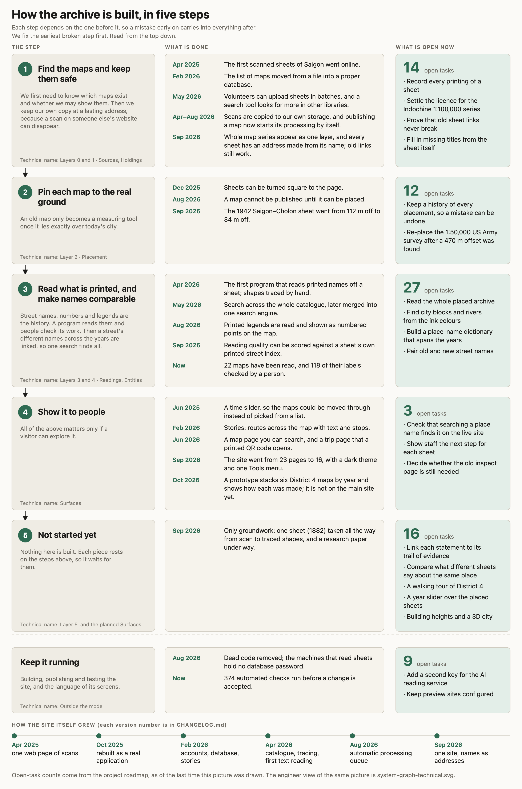

# System graph



The plain-language view, for anyone. Five steps a map goes through, from finding it to showing it,
with what is done and what is open at each. Each step depends on the one before it, so a mistake
early on carries into everything after. Fix the earliest broken step first. "Keep it running" sits
apart because it is not a layer.

The five are the plan's layers folded together: Find and keep (0–1), Place (2), Read and name (3–4),
Show (Surfaces), and **Not started yet** (layer 5, the Walk items, and `building-attributes`). The
version animation `work/proto/fabric/journey.html` uses the same five. Which open items count as
"not started" is decided in `gen_system_graph.py` from §9 and ROADMAP's Walk section, so the counts
follow the docs: 14 + 12 + 27 + 3 + 16 = 72, plus 9 for keeping it running, which is §9's 81.

## Engineer view

`system-graph-technical.png` (and `.svg`) shows the plan's eight layers unfolded, as in
`docs/knowledge-system-plan.md` §9, with the tools, research files and git branches in each row.

- **Containment is the link.** A tool or research strand sits in the row of the layer it acts on.
  That placement is inferred from names and locations (2026-10-01); nothing in the repo declares it.
- **The one declared link** is the ROADMAP item name. ROADMAP → §9 files each item under a layer (the
  open-work column), and `items: [...]` on a `/changelog` release or `/blog` post is checked by
  `tests/work-items.spec.ts`.
- **Development history** is the right-hand column: per layer, which release added what, from
  `CHANGELOG.md` and the `/changelog` headlines. "After 7.4" marks work not yet in a release.

## In the prototype

`work/proto/fabric/` (the stacked six-sheet view) answers the same steps for one sheet at a time:
focus a sheet and the Sheets tab shows "How <year> was made" — control points and error, paper
stretch, names read, names matched across years — from facts `layers.json` already carries.

## Regenerating

```
python3 scripts/gen_system_graph.py            # plain view     -> docs/system-graph.svg
python3 scripts/gen_system_graph_technical.py  # engineer view  -> docs/system-graph-technical.svg
node scripts/gen_system_graph_png.mjs          # both           -> .png, 2x, light theme
```

The layouts are fixed grids on purpose: an auto-layout (Mermaid, Graphviz) staggers the boxes and
clips the titles. The prose lives in each script (`STEPS` in the plain view, `ROWS` and `HISTORY` in
the engineer view). The open-task counts are parsed from §9, so they follow the plan without an edit.
