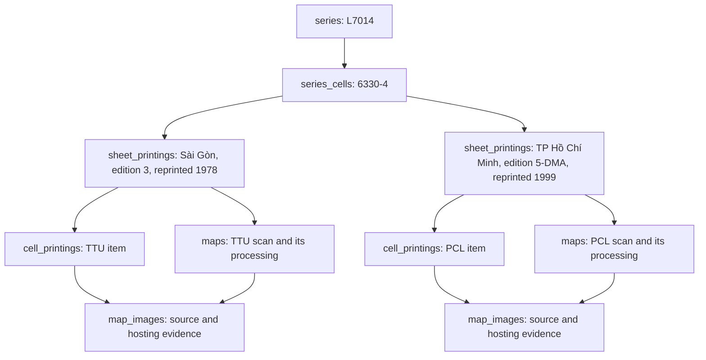

# Series, cells, printings and scans — database proposal

Based on the L7014 inventory and a read-only inspection of the live PostgREST schema,
migrations through 104, and current catalog readers on 2026-10-03. This is a proposal;
no schema or database rows were changed.

## What exists now

The original `maps` table replaced a flat Google Sheets catalog: name, year, thumbnail and
Allmaps id (migration 001). It now combines bibliographic description, series membership,
scan hosting, georeference, publication and processing settings.

| Object | Current storage | Limitation relevant to L7014 |
|---|---|---|
| Survey | `maps.collection` and generated `series_key` | The display label determines identity; no series table or FK |
| Survey cell | `series_cells`, PK `(series_key, sheet_number)` | One `map_id`, source, year and edition can describe only one held printing |
| Institution item | `cell_printings`, unique `(institution, source_ref)` | Called a printing, but its identity is the institution's item, not a printing shared by institutions |
| Served scan | `maps` | Multiple rows per cell are allowed, but edition/printing/source archive are JSON fields and there is no explicit printing FK |
| Image hosting | `map_images`, FK to `maps` | Several IIIF URLs per map; no dimensions, asset version or institution-item FK |
| Georeference history | `georef_versions`, FK to `maps` | Correctly scan-specific, but not connected to a durable image asset identity |

`sheet_sources` is the compatibility view for `cell_printings`; it is not another source table.
`map_iiif_sources` likewise aliases `map_images`. The live API schema confirms both aliases.

`fetchSheetEditions()` currently finds other `maps` rows with the same series key and sheet
number. This supports several editions without a unique-per-cell constraint, but treats every
other scan as an edition. `fetchSheetSources()` infers a source printing is held from the cell's
stored source/year/edition; missing values count as non-contradiction. It has no proven direct
relationship to the served scan or printing. `map_series` already counts distinct sheet numbers,
which is the correct basis for cell coverage, though it filters to georeferenced maps with bboxes.

References: migrations [083](../../../supabase/migrations/083_series_sheets.sql),
[087](../../../supabase/migrations/087_sheet_sources.sql),
[104](../../../supabase/migrations/104_maps_series_key.sql),
[source reader](../../../src/lib/data/maps/sheetSources.ts), and
[edition reader](../../../src/lib/data/maps/service.ts).

## Recommended structure

Keep the current `maps.id` as the identity of a served scan and processing workspace. Add
bibliographic relationships around it. Different scans of the same printing can have different
pixel grids, neatlines, GCPs and OCR, so they must remain separate map records until their image
identity and any retirement plan are reviewed.

1. **Add `series`.** UUID identity, stable unique route key, name, series code and scale.
   Producer defaults and reference-grid/datum descriptions may live here; an edition's issuer
   remains a printing fact. Display-name edits must not move sheets into another survey. Curated
   collections such as a District 4 selection need a separate membership concept.
2. **Keep one `series_cells` row per cell.** Add a UUID and `series_id` FK, with a unique
   `(series_id, sheet_number)` constraint. Own the survey-index geometry and index name here.
   The printed title, issue date and issuing agency belong to a printing. A reviewed default
   map may be selected for display, but it must not define the set of held editions.
3. **Add `sheet_printings`.** UUID, cell FK, printed title, part (`whole`, `W`, `E`, `assemblage`),
   verbatim edition statement, optional normalized edition label and issuer, content/preparation
   year, edition/revision year, printing year and optional printing month, printer, verbatim
   printing statement, and evidence/review references. A printing belongs to a cell, independently
   of who scanned it. Standalone maps may retain null series/printing links during this rollout.
4. **Treat existing `cell_printings` rows as institution items.** Keep their ids and unique
   `(institution, source_ref)` keys; add a nullable `printing_id` FK. Preserve original catalog
   metadata, URL, rights and holder separately from reviewed bibliographic facts. An item with
   unreadable margins stays unresolved instead of being automatically assigned to a printing.
   Once compatibility readers are migrated, a name such as `source_items` would describe this
   table more accurately. Renaming it is not required for the first migration.
5. **Link maps and images explicitly.** Add nullable `maps.printing_id`; add an optional
   institution-item FK to `map_images`, plus image dimensions and a version/content identity.
   Require a map's printing and its resolved image source's printing to agree when both are
   known. Alternate URLs under one map must serve the same pixel coordinate frame; another
   institution's independently scanned copy needs another map record. A new image frame
   invalidates pixel work; a new georeference invalidates derived ground work.

Edition is initially a reviewed attribute of a printing, with both verbatim and normalized
values. A separate edition entity can follow if shared revision histories across many cells
need it. It should not be inferred by using edition number alone: 3-AMS, 3-DMA and a Vietnamese
third printing do not assert the same publication identity.

Do not use `(cell, year, edition)` as the unique key for a printing or as an automatic merge
rule. Missing fields, agency changes and later impressions make that unsafe. Give identities
UUIDs and merge only on reviewed evidence, retaining the source assertions.

## Catalog behavior after linking

- A cell page lists all resolved printings and unresolved institutional items. Under a printing,
  show its source copies and served scans; do not call each scan another edition.
- Public coverage counts distinct cells with public served scans. Printings, maps records and
  known external source items are separate totals. A draft or ANU handle alone does not add to
  public coverage. Availability or preparation state can be shown separately.
- Derive held counts and printing availability through the explicit links. Remove the inferred
  source/year/edition match. Do not use absence of contradictory metadata as positive identity
  evidence.
- Derive cell coverage in a role-aware view, replacing hand-maintained `held_by`/`map_id`
  snapshots. Ensure views using service credentials explicitly preserve the public/draft gate.
- Use content dates for historical comparison and printing dates for impressions/duplicate
  review. Preserve current `maps.year` semantics during the initial backfill; migrate readers
  deliberately once dates have evidence. Do not reinterpret every existing year in bulk.
- Keep UUIDs, slugs, aliases, annotations, OCR and footprint links. A bibliographic regrouping
  must not regenerate image processing or change addresses.

## Rollout recommended for this work

1. Finish the organized inventory and margin evidence. The existing tables can hold the raw
   observations while printing identity remains unresolved.
2. Add the series/cell identities and printing links through small additive migrations. Keep
   compatibility fields and views while readers move. Do not invent printings from null years
   or collapse source records during the schema backfill.
3. Pilot on 6330-4, 6329-1, 5452-1 and 6542-3. These exercise distinct editions, a later reprint,
   and two source formats for one cell. Include a same-printing/two-institutions case only after
   evidence confirms it. Also validate an Indochine half-sheet/assemblage and a standalone map.
4. Move the catalog's edition list and coverage reads to the linked model. Preserve the 627-cell
   denominator while every retained printing remains visible. Resolve provenance gaps and
   record reviewed default selections separately from completeness.
5. Define duplicate retirement before archiving. `maps.status` currently accepts only
   `draft | public | featured`; there is no archival state. A reviewed `archived` lifecycle state
   and nullable `duplicate_of_map_id` would preserve records and provenance, but require coordinated
   RLS, route, queue and type changes. Do not delete a scan's processing artifacts or redirect
   an old sheet URL until its surviving target is settled.

This refines existing ROADMAP subjects `series-identity`, `multi-printing-cells` and
`held-by-derived`. In particular, the current proposal to widen `series_cells`' key should be
replaced by linked printing records: repeating cells in the denominator would mix coverage
with edition counts. Update ROADMAP and the model-plan index together when adopting the plan.

## Separate defect found during inspection

The live API schema reports `maps.status` defaulting to `pending_georef`, while migration 038
permits only `draft`, `public` and `featured`. Migration 038 changed the values and constraint
without changing the old default introduced in 026. Inserts that omit status can therefore
fail that constraint. Confirm the default through SQL metadata and correct it to `draft` in
a focused migration, with a meaningful insert check. This is independent of the series redesign.
